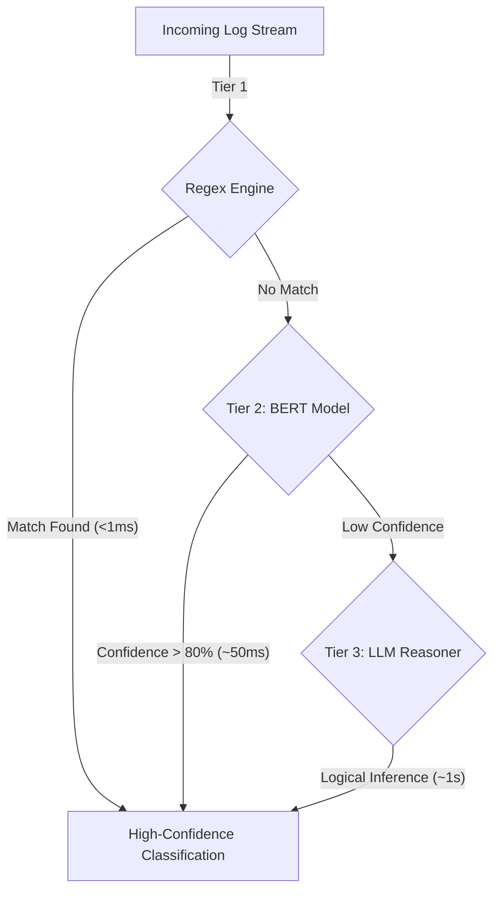

# 🧠3-Tier-ML-Pipeline-For-Logs-Analysis


> **A machine learning system that automates log analysis using a multi-stage hybrid architecture.**

---

## 🚀 Overview

The **Model* is an enterprise-ready solution designed to automate the categorization of system logs. It moves beyond simple keyword matching by employing a **Three-Tier Waterfall Architecture** that balances speed, accuracy, and cost.

It solves the problem of "alert fatigue" in DevOps environments by intelligently distinguishing between critical infrastructure failures (which need immediate attention) and routine operational noise.

## 🏗️ System Architecture

The core innovation is the **Hybrid Classification Pipeline**, which intelligently routes logs through three progressively smarter stages to optimize for latency and compute resources:



| Tier | Technology | Latency | Use Case |
| :--- | :--- | :--- | :--- |
| **1. Regex** | Compiled Patterns | **<1ms** | Instantly catches ~70% of known, repetitive logs (e.g., HTTP 200). |
| **2. BERT** | `all-MiniLM-L6-v2` | **~50ms** | Semantic search for logs with varying phrasing but similar meaning. |
| **3. LLM** | Groq (`llama-3-70b`) | **~1s** | Handles edge cases, deprecated warnings, and complex reasoning. |

---

## ✨ Key Features

### 🖥️ Professional Dashboard
A modern, dark-mode web interface designed for Ops teams, featuring **Glassmorphism** UI principles.
*   **Drag-and-Drop** log file upload (CSV, JSON, LOG).
*   **Real-time Visualization** with interactive Chart.js analytics.
*   **Responsive layouts** for mobile and desktop monitoring.

### 🛡️ Engineering Excellence
*   **Rate Limiting:** Protects API endpoints from abuse using token buckets.
*   **Async Processing:** Non-blocking FastAPI architecture for high-throughput ingestion.
*   **Robust Error Handling:** graceful degradation if ML models fail.
*   **Secure:** CORS configured and environment-variable driven configuration.

---

## 🛠️ Technology Stack

| Component | Technology | Why? |
| :--- | :--- | :--- |
| **Backend** | **FastAPI** | High-performance, async Python web framework. |
| **ML Core** | **PyTorch / BERT** | State-of-the-art semantic embedding generation. |
| **AI Inference** | **Groq LPU** | Ultra-low latency inference for LLM fallback. |
| **Data Processing** | **Pandas** | Efficient handling of large CSV/JSON datasets. |
| **Frontend** | **Vanilla JS / CSS** | Lightweight, dependency-free dashboard for max performance. |
| **Testing** | **Pytest** | Comprehensive unit and integration testing coverage. |

---

## 📦 Installation & Setup

### Prerequisites
*   Python 3.11+
*   Groq API Key (Required for Tier 3 classification)

### 1. Clone the Repository
```bash
git clone https://github.com/SarvagyaGupta-19/Log_classification_system.git
cd Log_classification_system
```

### 2. Install Dependencies
```bash
pip install -r requirements.txt
```

### 3. Configure Environment
Create a `.env` file in the root directory:
```env
# Required for Stage 3 (LLM)
GROQ_API_KEY=your_groq_api_key_here

# Application Settings
DEBUG=False
LOG_LEVEL=INFO
```

### 4. Run the Server
```bash
uvicorn server:app --reload
```

Access the dashboard at: `http://localhost:8000`

---

## 🧪 Testing

Run the automated test suite to verify the pipeline integration:

```bash
pytest tests/
```

---

## 👨‍💻 Author

**Sarvagya Gupta**  
*Machine Learning Engineer

[GitHub](https://github.com/SarvagyaGupta-19) | [LinkedIn](https://linkedin.com/in/sarvagyagupta019)
